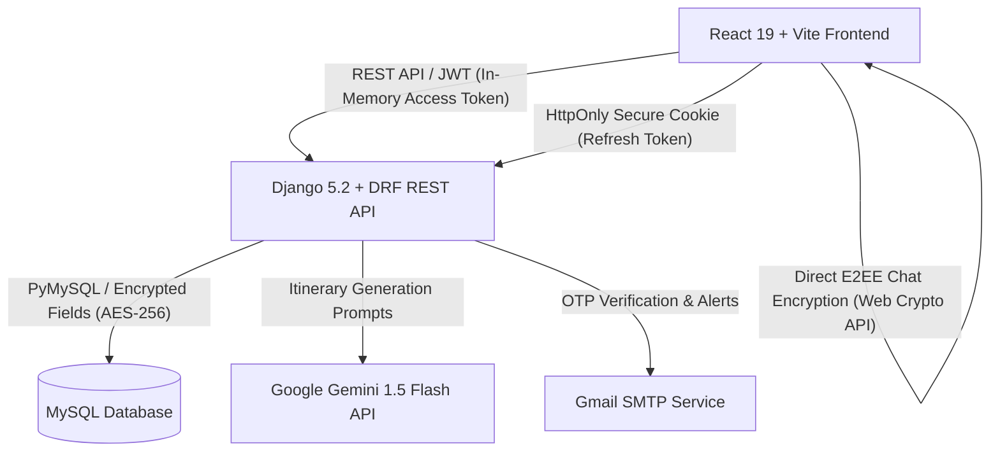

<div align="center">

# 🇧🇩 TripoBD — Plan Smart. Travel Together.

**The Ultimate Collaborative & AI-Powered Travel Management Platform for Bangladesh**

[](https://react.dev/)
[](https://vitejs.dev/)
[](https://www.djangoproject.com/)
[](https://www.django-rest-framework.org/)
[](https://www.mysql.com/)
[](https://ai.google.dev/)
[](https://developer.mozilla.org/en-US/docs/Web/API/Web_Crypto_API)
[](LICENSE)

*A full-stack, enterprise-grade travel platform engineered to connect Bangladeshi travelers, verified local tour guides, and collaborative trip communities with hardened cybersecurity and artificial intelligence.*

---

</div>

## 📖 Table of Contents

- [🌟 Features Overview](#-features-overview)
  - [1. Traveler Portal & Personal Dashboard](#1-traveler-portal--personal-dashboard)
  - [2. Tour Rooms (Collaborative Group Trip Planner)](#2-tour-rooms-collaborative-group-trip-planner)
  - [3. AI Travel Assistant (Google Gemini)](#3-ai-travel-assistant-google-gemini)
  - [4. Traveler Community & Social Circle](#4-traveler-community--social-circle)
  - [5. Guide Portal & Local Bookings](#5-guide-portal--local-bookings)
  - [6. Admin Control Center & Content Management](#6-admin-control-center--content-management)
- [🛡️ Enterprise Security Architecture (F1–F9)](#️-enterprise-security-architecture-f1f9)
- [🏗️ Tech Stack & Architecture](#️-tech-stack--architecture)
- [📂 Project Directory Structure](#-project-directory-structure)
- [⚙️ Step-by-Step Setup & Build Guide](#️-step-by-step-setup--build-guide)
  - [Prerequisites](#prerequisites)
  - [1. Backend Setup (Django + MySQL)](#1-backend-setup-django--mysql)
  - [2. Frontend Setup (React + Vite)](#2-frontend-setup-react--vite)
- [👤 Test Credentials & Seed Accounts](#-test-credentials--seed-accounts)
- [🧪 Running Security Verification Tests](#-running-security-verification-tests)
- [📡 Core API Endpoints Summary](#-core-api-endpoints-summary)
- [🤝 Contributing & License](#-contributing--license)

---

## 🌟 Features Overview

### 1. Traveler Portal & Personal Dashboard
* **Dynamic Welcome & Countdown:** Tracks active and upcoming trips with real-time countdown timers.
* **Smart Wishlist & Bookings:** Curate favorite destinations across Bangladesh (Cox's Bazar, Sajek, Sundarbans, Sreemangal, etc.) and convert them into collaborative rooms with one click.
* **Trip Stories & Reviews:** Author interactive travel diaries with image carousels, likes, comments, and ratings.
* **Notification Hub:** Real-time channel for booking confirmations, room invitations, and community mentions.
* **Security & Preferences Hub:** Manage privacy, 2FA settings, dark/light theme, blocked users, and data export.

### 2. Tour Rooms (Collaborative Group Trip Planner)
A live virtual room where travel groups co-plan every aspect of their journey:
* 🔒 **End-to-End Encrypted Group Chat:** Real-time communication protected by client-side AES-GCM-256 encryption.
* 📋 **Shared Checklist:** Create, assign, and toggle travel prep tasks collaboratively.
* 🗳️ **Live Polls:** Democratically vote on destinations, departure times, and hotel options.
* 💰 **Expense Splitter:** Split shared expenses across members, calculate individual debts, and mark payments.
* 📍 **Interactive Map Pins:** Pin waypoints and scenic spots directly on a collaborative Leaflet map.
* 📝 **Booking Records:** Centralize accommodation vouchers, bus tickets, and confirmation notes.

### 3. AI Travel Assistant (Google Gemini)
* Natural language conversation powered by **Gemini AI** configured with domain knowledge of Bangladesh travel logistics.
* Generates tailored day-by-day itineraries with estimated budgets, local transport tips, and safety advice.
* One-click option to save generated itineraries directly into personal plans.

### 4. Traveler Community & Social Circle
* **Community Feed:** Public feed with travel updates, verified recommendations, and photos.
* **Group Directory:** Discover and join public/private travel clubs across different divisions of Bangladesh.
* **Leaderboards & Badges:** Gamified badges for frequent travelers and top story contributors.

### 5. Guide Portal & Local Bookings
* **Guide Onboarding & Verification:** Guides submit national identification (NID) and credentials for administrator audit.
* **Guide Dashboard:** Real-time visibility into booking requests, earnings, traveler reviews, and performance metrics.
* **Direct Booking Channel:** Travelers can book verified guides for custom local tours.

### 6. Admin Control Center & Content Management
* **Comprehensive Metrics:** Platform-wide active user analytics, revenue charts, and registration trends.
* **Moderation Panel:** Review flagged community posts, verify guide license applications, and handle user reports.
* **Dynamic CMS:** Live management of landing hero content, FAQs, bus/train routes, and destinations.
* **Security Audit Viewer:** Immutable logs tracking administrative actions, user logins, and privilege changes.

---

## 🛡️ Enterprise Security Architecture (F1–F9)

TripoBD integrates a multi-layered security framework designed to protect user privacy, confidential PII, and financial records:

| Feature ID | Security Layer | Technical Implementation |
| :--- | :--- | :--- |
| **F-01** | **Time-Based 2FA (TOTP)** | RFC 6238 TOTP with Google Authenticator / Authy support, QR generation, 16-character backup recovery codes, and rate-limited verification. |
| **F-02** | **Hardened JWT Architecture** | Short-lived (15 min) in-memory access tokens; refresh tokens stored exclusively in `HttpOnly`, `SameSite=Lax`, `Secure` cookies with automatic token rotation. |
| **F-03** | **End-to-End Encryption (E2EE)** | Web Crypto API (AES-GCM 256-bit) encrypts tour room chat messages on the client before transmission. The server stores ciphertext and cannot decrypt messages. |
| **F-04** | **Application-Level PII Encryption** | AES-256-CBC with SHA-256 key derivation automatically encrypts sensitive database fields (National IDs, Bank Accounts, Emergency Contacts). |
| **F-05** | **Object-Level Access Control** | Custom Django REST Framework permissions (`IsRoomMember`, `IsRoomAdmin`, `IsBookingParticipant`) enforcing strict boundary authorization. |
| **F-06** | **Multi-Tiered Rate Limiting** | Tiered burst/sustained throttling on authentication endpoints (`5/min` login attempts, `60/min` general APIs) to prevent brute-force attacks. |
| **F-07** | **Immutable Audit Logging** | `django-simple-history` tracks delta changes, historical states, and actor IPs on sensitive models. |
| **F-08** | **Secure File Processing** | Magic byte validation (`python-magic`), strict MIME type allowlisting, filename sanitization, UUID paths, and 5MB size limits preventing web shell uploads. |
| **F-09** | **UUID Primary Keys** | Non-sequential cryptographic UUIDv4 identifiers across sensitive resources to prevent IDOR and enumeration attacks. |

---

## 🏗️ Tech Stack & Architecture



* **Frontend:** React 19, Vite 8, React Router DOM v6, Leaflet Maps, Web Crypto API
* **Backend:** Python 3.10+, Django 5.2+, Django REST Framework (DRF), PyJWT, Cryptography, PyOTP, django-simple-history
* **Database:** MySQL 8.0+ / PyMySQL
* **AI & External APIs:** Google Gemini AI API, OpenStreetMap, Leaflet Tile Providers
* **Email & Transports:** Django SMTP Email Backend (TLS/Gmail App Password)

---

## 📂 Project Directory Structure

```text
TripoBD/
├── Backend/
│   ├── api/
│   │   ├── migrations/             # Database migration history
│   │   ├── management/commands/    # Mock data seeding scripts (seed_data, etc.)
│   │   ├── authentication.py       # Custom JWT & Cookie authentication handlers
│   │   ├── auth_jwt_views.py       # 2FA and Token rotation endpoints
│   │   ├── cryptography_fields.py  # Application-level AES-256 field encryption
│   │   ├── models.py               # Core data models (User, TourRoom, Guide, etc.)
│   │   ├── permissions.py          # Object-level security permissions
│   │   ├── throttling.py           # Custom rate limiting throttles
│   │   ├── views.py                # Business logic and REST views
│   │   └── urls.py                 # API route mapping
│   ├── config/                     # Django core settings (settings.py, wsgi.py)
│   ├── media/                      # Uploaded user avatars and tour attachments
│   ├── scratch/                    # Security test suites (F1–F9 test runners)
│   ├── .env.example                # Backend environment template
│   └── requirements.txt            # Python dependencies
│
├── Frontend/
│   ├── public/                     # Static public assets
│   ├── src/
│   │   ├── components/             # Reusable UI (Navigation, TravelerSidebar, Footer, MapView)
│   │   ├── pages/                  # Page components (SignIn, TravelerDashboard, TourRoom, etc.)
│   │   ├── utils/                  # E2EE Web Crypto encryption utilities (e2ee.js)
│   │   ├── apiClient.js            # In-memory JWT Axios/Fetch API client
│   │   ├── App.jsx                 # Client router & navigation selectors
│   │   └── main.jsx                # Application root entry
│   ├── .env.example                # Frontend environment template
│   ├── index.html                  # HTML entrypoint
│   └── package.json                # Node.js dependencies & build scripts
│
├── docs/                           # Architecture guides and research papers
├── how_to_check.md                 # Step-by-step feature verification walkthrough
└── README.md                       # Main project documentation
```

---

## ⚙️ Step-by-Step Setup & Build Guide

### Prerequisites
Before getting started, make sure you have the following installed on your system:
- **Node.js** (v18.x or v20.x recommended) & **npm**
- **Python** (v3.10, v3.11, or v3.12)
- **MySQL Server** (v8.0+ running locally or in Docker)
- **Git**

---

### 1. Backend Setup (Django + MySQL)

1. **Clone the repository:**
   ```bash
   git clone https://github.com/shuivva/TripoBD.git
   cd TripoBD/Backend
   ```

2. **Create and activate a virtual environment:**
   * **Windows (PowerShell):**
     ```powershell
     python -m venv venv
     .\venv\Scripts\Activate.ps1
     ```
   * **macOS / Linux:**
     ```bash
     python3 -m venv venv
     source venv/bin/activate
     ```

3. **Install Python dependencies:**
   ```bash
   pip install -r requirements.txt
   ```

4. **Set up your environment variables:**
   Copy `.env.example` to `.env`:
   ```bash
   cp .env.example .env
   ```
   Open `.env` and fill in your database credentials and secret key:
   ```ini
   SECRET_KEY=your-django-secret-key-at-least-50-characters
   FIELD_ENCRYPTION_KEY=your-32-byte-hex-or-base64-encryption-key
   DEBUG=True

   # Database Configuration
   DB_ENGINE=django.db.backends.mysql
   DB_NAME=tripo_db
   DB_USER=root
   DB_PASSWORD=your_mysql_password
   DB_HOST=127.0.0.1
   DB_PORT=3306

   # Email Credentials (Optional for local dev, required for OTP emails)
   EMAIL_HOST_USER=your_email@gmail.com
   EMAIL_HOST_PASSWORD=your_gmail_app_password
   DEFAULT_FROM_EMAIL=your_email@gmail.com
   ```

5. **Create MySQL Database:**
   Log into MySQL:
   ```sql
   CREATE DATABASE tripo_db CHARACTER SET utf8mb4 COLLATE utf8mb4_unicode_ci;
   ```

6. **Run Database Migrations:**
   ```bash
   python manage.py makemigrations api
   python manage.py migrate
   ```

7. **Seed Initial Mock Data (Destinations, Guides, Demo Accounts):**
   ```bash
   python manage.py seed_data
   ```

8. **Start the Django Backend Server:**
   ```bash
   python manage.py runserver 127.0.0.1:8000
   ```
   *Backend API is now live at: `http://127.0.0.1:8000/`*

---

### 2. Frontend Setup (React + Vite)

1. **Open a new terminal and navigate to the `Frontend` directory:**
   ```bash
   cd TripoBD/Frontend
   ```

2. **Set up client environment variables:**
   Copy `.env.example` to `.env.local`:
   ```bash
   cp .env.example .env.local
   ```
   Configure the API base URL and Gemini key:
   ```ini
   VITE_API_BASE_URL=http://localhost:8000/api
   VITE_GEMINI_API_KEY=your_gemini_api_key_here
   ```

3. **Install Node dependencies:**
   ```bash
   npm install
   ```

4. **Run the Development Server:**
   ```bash
   npm run dev
   ```
   *Frontend is now live at: `http://localhost:5173/`*

5. **Build for Production (Optional):**
   To produce an optimized production bundle:
   ```bash
   npm run build
   ```
   To preview the production build locally:
   ```bash
   npm run preview
   ```

---

## 👤 Test Credentials & Seed Accounts

After executing `python manage.py seed_data`, you can sign in to the platform with the following demo credentials:

| Role | Username / Email | Password | Access Level |
| :--- | :--- | :--- | :--- |
| **Traveler (Default)** | `traveler1` / `traveler@tripobd.com` | `Traveler@123` | Traveler Dashboard, Tour Rooms, Wishlists, Stories |
| **Tour Guide** | `guide1` / `guide@tripobd.com` | `Guide@123` | Guide Portal, Earnings, Bookings Management |
| **System Admin** | `admin` / `admin@tripobd.com` | `Admin@123` | Admin Panel, Moderation, Logs, User Management |

---

## 🧪 Running Security Verification Tests

Automated verification test suites are located in `Backend/scratch/`:

```powershell
# In Backend/ with venv activated:
python scratch/test_security_f1_f2.py   # Verify 2FA & JWT Cookie rotation
python scratch/test_security_f3.py      # Verify E2EE chat payloads
python scratch/test_security_f4_f5.py   # Verify DB field encryption & Object permissions
python scratch/test_security_f6_f7.py   # Verify Rate Limiting & Audit trails
python scratch/test_security_f9.py      # Verify UUID primary key enforcement
```

---

## 📡 Core API Endpoints Summary

| Method | Endpoint | Description |
| :--- | :--- | :--- |
| `POST` | `/api/auth/login/` | Primary login (returns JWT + sets HttpOnly cookie or initiates 2FA) |
| `POST` | `/api/auth/2fa/verify/` | Verify TOTP code and issue tokens |
| `POST` | `/api/auth/token/refresh/` | Silent token refresh via HttpOnly cookie |
| `POST` | `/api/auth/logout/` | Blacklists refresh token and deletes cookie |
| `GET` | `/api/traveler/dashboard/?user_id={id}` | Fetches traveler profile, countdowns, and summary stats |
| `GET` / `POST` | `/api/tour-rooms/` | List or create collaborative tour planning rooms |
| `GET` / `POST` | `/api/tour-rooms/{id}/chat/` | Send or receive encrypted tour room chat messages |
| `GET` / `POST` | `/api/tour-rooms/{id}/expenses/`| Split costs and track payment status |
| `GET` / `POST` | `/api/guides/` | Verified guide directory and service listings |
| `GET` | `/api/destinations/` | Destination catalog with routes and travel advice |

---

## 🤝 Contributing & License

Contributions, issues, and feature requests are welcome! Feel free to check the [issues page](https://github.com/shuivva/TripoBD/issues).

Distributed under the MIT License. See `LICENSE` for more information.

<div align="center">
  <sub>Built with ❤️ for Bangladesh travelers. Plan Smart. Travel Together.</sub>
</div>
